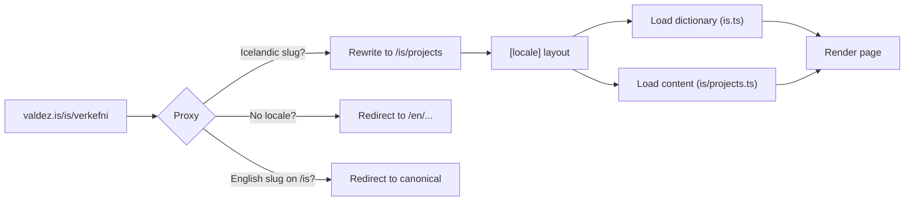

# valdez.is

Yes, this is a personal website with a CI pipeline, 43 unit tests, 76 end-to-end tests, automated accessibility audits on every page in both languages, bilingual routing with translated URL slugs, middleware that rewrites Icelandic vanity paths, a typed i18n dictionary system, print-optimized resume styles, pre-commit hooks running lint-staged, pre-push hooks that won't let you push broken code, and a CSS gradient system driven by custom properties in oklab color space.

For a site that is essentially five pages and a blog.

Could it have been a single HTML file? Absolutely. And sometimes that's the right call. But this repo doubles as a showcase of how I work when the goal is to do things properly: clean architecture, solid testing, and the kind of attention to detail that's hard to demonstrate in a conversation. Think of it less as a website and more as an open-source portfolio piece that happens to have a URL.

## On AI-augmented development

This project was built with [Claude Code](https://claude.ai/code). I make every architectural decision, define the constraints, set the direction, and review what goes in. AI is the execution layer — scaffolding, refactoring, writing tests — that lets me maintain a high standard without it taking forever. If AI disappeared tomorrow, the work continues; the tool accelerates, it doesn't enable.

Using AI well is a skill in itself. Knowing what to delegate, when to override, how to frame the problem so you get the right abstraction, and when to just write the code yourself. The quality of the output is still on you.

## The interesting bits

**Bilingual routing with vanity URLs.** Both locales get URL prefixes, but Icelandic routes use translated slugs (`/is/hver-er-eg` not `/is/about`). The slug mappings are defined once in `config.ts` and used everywhere: proxy, navigation, sitemap, `hrefLang` alternates, language switcher. Add a new page and the routing just works.

**Per-page oklch gradients.** Each page sets 4 CSS custom properties and the gradient expression stays the same everywhere. The landing page gradient is hand-tuned in oklab color space and took an unreasonable amount of time to get right. Don't touch it.

**Living resume.** The `/resume` page reads from the same typed data files as the rest of the site. `Cmd+P` produces a clean PDF with locale-aware tech stack labels, proper page breaks, and no UI chrome. No more maintaining a separate PDF that's always out of date.

**Accessibility as a constraint, not a checkbox.** jsx-a11y in strict mode, axe-core scanning every page on every push, `:focus-visible` with Safari fallback, skip-to-content, semantic landmarks, WCAG AA contrast. If it doesn't pass the automated audit, it doesn't ship.

**Content as code.** TypeScript data files for structured content, MDX for prose. Type-safe, diffable, no CMS to maintain. Both locales are validated for structural symmetry in tests, so you can't accidentally add an English job entry without its Icelandic counterpart.

## Tech stack

| Layer      | Choice                                                 |
| ---------- | ------------------------------------------------------ |
| Framework  | Next.js 16 (App Router), React 19, TypeScript          |
| Styling    | CSS Modules, oklch gradient system                     |
| Icons      | Phosphor Icons                                         |
| Content    | TypeScript data files + MDX                            |
| Unit tests | Vitest (43 tests)                                      |
| E2E + a11y | Playwright + axe-core (76 tests)                       |
| CI/CD      | GitHub Actions, Vercel                                 |
| Git hooks  | Husky (lint-staged on commit, full test suite on push) |

## Architecture

```
src/
  app/
    [locale]/             # All pages nested under locale (en/is)
      (site)/             # Route group for pages with side nav
        about/            # Who am I
        projects/         # Personal + community work
        thoughts/         # Blog (MDX)
        resume/           # Living resume with print styles
      page.tsx            # Landing page
    layout.tsx            # Root layout (fonts, metadata, skip-to-content)
    globals.css           # Design tokens, resets, print styles
    sitemap.ts            # Auto-generated with locale alternates
    robots.ts             # Crawler config
  components/             # UI components with co-located CSS Modules
  content/
    en/, is/              # Typed content per locale
    recommendations.ts    # Language-agnostic quotes
    social.ts             # Shared social link data
  i18n/
    config.ts             # Slug mappings, locale utilities
    dictionaries/         # Type-safe UI strings
    getDictionary.ts      # Async dictionary loader
  lib/                    # Fonts, MDX utilities
  proxy.ts                # The brains of the routing operation
  thoughts/               # MDX blog posts per locale
```

## How a request becomes a page

Every URL hits the proxy layer first. Depending on what it finds, it either rewrites, redirects, or passes through. Here's what happens when someone visits the Icelandic projects page:



The proxy handles three scenarios: Icelandic vanity slugs get silently rewritten to the actual route files (the URL stays pretty), English slugs under `/is/` get redirected to their canonical Icelandic form, and bare paths without a locale prefix get redirected based on the browser's `Accept-Language` header.

## Development

```bash
npm install
npm run dev
```

## Testing

```bash
npm run test        # Vitest watch + UI + coverage
npm run test:ci     # Vitest single run + coverage
npm run test:e2e    # Playwright: routes, a11y, navigation, metadata, print
npm run lint        # ESLint with jsx-a11y strict
```

## Deployment

Every push triggers CI: lint, unit tests, build, e2e + accessibility. Nothing deploys until everything passes.

- Pushes to `next` deploy a preview
- GitHub Releases trigger production deployment
